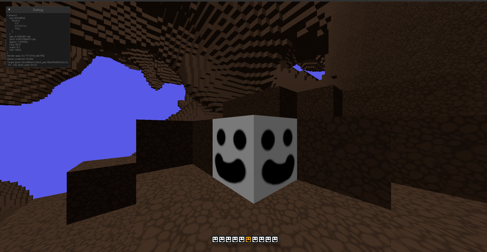

# 3D Game Engine
Experimenting with a 3D rendering / game engine. Currently aiming towards something Minecraft-like, simple voxel based environment.

### Current status
**Player**  
Mincraft creative mode-style flying movement.
Space-like interia flying movement.
Collision detection.

**World**  
Multiple block types (now with some nicer textures).  
Basic world gen using Perlin noise (now infinite in all 3 directions).  
Dynamic world gen as player moves around.

**Rendering**  
Mesh based rendering with multiple textures.  
Dynamic culling for non-exposed blocks and chunks too far from the camera.  
Pre-generated block exposure information so it's not on the hot path
Basic lighting.

