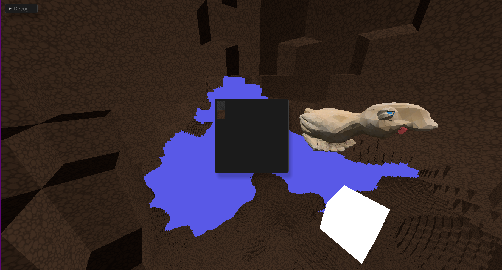

# 3D Game Engine
Experimenting with a 3D rendering / game engine. Currently aiming towards something Minecraft-like, simple voxel based environment.

### Current status
**Player**  
Camera & flying movement.  

**World**  
Multiple block types.  
Basic world gen using Perlin noise.  

**Rendering**  
Mesh based rendering with multiple textures.  
Dynamic culling for non-exposed blocks and chunks too far from the camera.  

