# Dev Log

## Day 1
Today's goal was to learn the basics of windowing & rendering in rust.  
I'm following along with the [Learn WGPU](https://sotrh.github.io/learn-wgpu/) and [Winit](https://docs.rs/winit/latest/winit/) tutorials.  

For my blocks, I'm rendering each face individually. Each face consists of 4 vertices in unit space, which are mapped to quick texture that I created in GIMP.  
To create a block, I'm creating 6 different instances of a face, which just transforms the face from unit-space into world space with a translation and rotation.  
So to create a simple 8x8x8 cube of blocks (which was about the limit where performance started to degrade), It's a total of 3072 faces being rendered.  

The render pipeline is pretty close to the Learn WGPU tutorial. It consists of:  
1) A handle to my GPU (or integrated graphics in the case of my laptop).  
2) A Winit window and drawable surface on it.  
3) A queue which is like a pipe to send commands to the GPU.  
4) A command encoder which translates the cross-platform commands into hardware-specific commands to be sent down the queue.  
5) A WGSL shader which runs on the GPU to do the drawing.  
6) Bind groups which allow you to group resources and swap them out easily during the rendering pass. The "layout" tells the shader code how the data buffers are interpreted, while the bind group itself links in the actual data buffers.  
7) A render pipeline, which is basically a combination of all of the above. You'd usually have one pipeline for each type of rendering you want to do. In my case a renderable in-world object.  

For the texture rendering, I've also got a depth buffer, which makes sure that objects are rendered in the right order. I don't think this prevents the GPU from actually doing the rendering, only that pixels are rendered in the right order, so it doesn't help much with performance.  

Since this is just a simple rendering MVP, I'm loading all of the data buffers onto the GPU up-front. In a real game I'll want to do this dynamically as the player moves around / interacts with the world.  
During the rendering pass which happens every frame, I first do some setup. 
1) I tell my encoder to start a new render pass, clearing the old screen and setting it to grey (my skybox colour). I also clear my depth buffer.  
2) I load up the render pipeline and bind groups for my textures and camera (will discuss camera later).  
3) I load up my data buffers. They're already on the GPU, they just need to be set as active.  
4) I send a draw command. This basically just executes the shader code on the loaded data.  

I also have some debug text that I want to draw on screen. Since I'm not using any sort of UI library, I'm just using [wgpu-text](https://github.com/Blatko1/wgpu-text).  
For now I'm just showing the camera variables, since it was a bit tricky to get the camera controller code right without visual feedback.  
The text render pass is a lot simpler, I just begin a new render pass, this time without clearing the screen, and the text.  

All of this so far has just been preparing actions for the GPU to do, it hasn't actually ran them. The last thing to do is to execute them by sending them to the queue.  
Side note: Interacting with a GPU is usually an async thing. The only async needed was to create the initial device handle, so I'm assuming that everything else is a blocking API abstracted away by WGPU. I'm using [Tokio](https://tokio.rs/) which is probably overkill, but I'm familiar with it and it might come back into play later when I want to do something like async world loading.  

Moving onto the camera then, I'm just doing a basic one that looks at the world origin and rotates around it, similar to say a 3D modelling tool.  
The state and behaviour of the camera are split out into a Camera (state) and CameraController (behaviour). This will let me swap them out easily for different types of movement, eg. walking around vs flying.  
During the rendering, the camera is turned into a [View-Projection Matrix](https://jsantell.com/model-view-projection/), which basically encodes all the transformations needed (translation, rotation, perspective) to go from world-space to camera-space into a single matrix. The cool thing about this is that you can [compose](https://en.wikipedia.org/wiki/Transformation_matrix#Composing_and_inverting_transformations) a complex chain of transformations into a single matrix up-front, then applying them to each object is constant time.  
The camera matrix is passed to the shader during the rendering pass to put objects in the right spot.  

For the camera controller, I'm using an extremely simple one. It uses WASD, space, Z to go in/out/up/down/left/right. Winit events are intercepted and passed to the controller if they're keyboard inputs.  

All in all pretty happy with day 1's progress. Got the basics of rendering and event handling sorted. Here's what the final result looks like:  
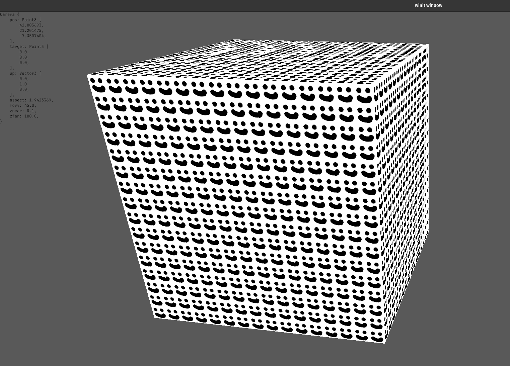

## Day 2
Today I wanted to do 2 things: 1) Improve the camera 2) Work with 3D models rather than creating blocks manually from faces.  

For the camera, I wanted to change the behaviour of the controller into something more fit for a game. So I decided to go for a simple flying style (think minecraft creative mode).  
Previously, my camera state was stored as a position and a "looking at" location. This is fine for an orbiting style camera like I had before, but for a player camera I switched to a position + pitch/yaw. This was easier to work with since I'd just be treating the mouse movement as angle deltas.  
One edge case I had to deal with was when the player looks straight up/down. When the up & looking at vectors are parallel things get funky with the calculations. Instead of actually dealing with this, I decided to just clmp the viewing angles so we wouldn't ever reach this state.  
To capture the mouse movements Winit has an AxisMotion event which tells you where the mouse has been moved to on each axis. I'm just mapping that to an angle delta in the controller.  
I also added a toggle button (Esc) for the controller. This will be used down the line to disable the camera movement when the player is in an interface like they're inventory.  

For the block modelling, it's following on to the end of the Learn WGPU tutorial. I'm using the [Wavefront OBJ](https://en.wikipedia.org/wiki/Wavefront_.obj_file) format, since it's human readable and most modelling software can export to it. It's a data file with the vertices, faces, normals, and texture coordinates for particular model. In my case it's a simple cube, so I got Claude to create one for me.  
There's also an associated [Material Template Library](https://en.wikipedia.org/wiki/Wavefront_.obj_file#Material_template_library) file, which defines textures, lighting, transparency, etc. For this I just pointed at my previous smiley face image.  
Other than loading the new model file, the rest of the process was fairly straight forward. I use [tobj](https://docs.rs/tobj/3.2.5/tobj/index.html) for loading the files, and then just create the vertex & index buffers from before.  

Result for today looks pretty much the same as yesterday. There's something funky going on with the block rendering, but that's a problem for next time.  
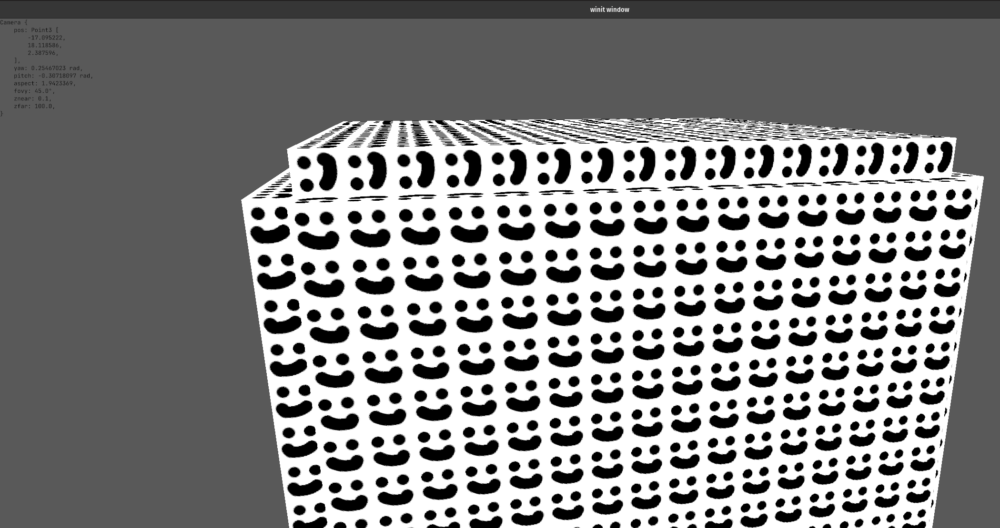

## Day 3
Today's goals:  
1) New block types  
2) A data structure for the world state, chunks, blocks, etc.  
3) Fix the rendering bug  

A voxel game is pretty boring if there's just a world full of one thing, so I wanted to have a way to easily extend to different block types. [Claude ended up helping me here](https://claude.ai/share/8320c181-b6b1-4ade-9cf5-b48b4e1399fe) by pointing towards 2D texture arrays. There are a similar enough concept to sprite sheets - a single texture that you index into.  
Extending my render pipeline to support texture arrays was trivial enough; Textures are packed into a single buffer, then indexed into by the shader by passing in the block ID as the index.  
The new block, creatively named smiley2, is just a re-coloured version of the original. I'm able to re-use the block mesh and just extend the MTL file with the new texture.  

Next it was time to tackle the world data. Since I want this to support very large (or infinite) worlds, chunking the world data was a no-brainer. This'll allow me to only load relevant parts of the world, and introduce a coarser granularity when doing various computations. I also didn't want to limit worlds to 2D, so my chunks will be cubes rather than vertically infinite chunks a-la minecraft.  
[Nice blog](https://0fps.net/2012/01/14/an-analysis-of-minecraft-like-engines/) on performance chararcteristics for voxel engines.  
When considering which data structures to choose, I'll consider a few access patterns:  
1) For the rendering pass, I'll need to visit every block so I don't want a bunch of expensive pointers or hashes.  
2) For player interactions, they'll likely be localised to around the player's position. So I'll need to be able to look up based on a position key.  
3) For block-block interactions, they'll likely be adjacent, so similar to #2  
4) Completely random access such as random events, monster spawns.  
5) Only loading needed chunks, which will be sparse.  

I decided to go with a HashMap for holding the chunks at a top level. This will allow me to have a sparse representation of loaded chunks. Hashing is pretty expensive in a hot loop, but I'm hoping I can minimise the number of chunk lookups I need to perform.  
For blocks within a chunk, I'll be storing them as a 3D array. This will allow very fast access once we're in the context of a chunk. It should also be the most compact way of storing the really granular block data.  
Here's how that'll look in terms of access:  
(C: Number of chunks, B: Number of blocks in a chunk)  
1) Iterating over all blocks: C + C * B iterations (No hash needed as we're just looping through all entries)  
2) Random access to a block: 1x hash, 1x array lookup  
3) Iterating over blocks around a given position: Small C (worst case 8 at the corner of a chunk) hashes + N array lookups depending on range  
4) Iterating over all blocks in a chunk: 1x hash + B iterations  

One variable to tweak is the size of the chunk. If it's too small, there will be too many hashes and slow things down. If it's too big, we're losing a lot of granularity for things like lazy loading. For now I'm going with a completely arbitrary 16x16x16.  

I had some WIP code from before to do loading/saving of worlds. Right now it just serialises each chunk to a binary file, then stores a world as a folder of chunk files.  

The rendering bug from last time ended up being simple. When moving from individual faces to the block mesh, I had forgot to change the instancing code. So for each block I was actually rendering 6 blocks in a 3d "+" shape.  

I also did a bunch of cleanup & refactoring, particularly with the rendering code as it was getting pretty unwieldy.  

Here's what today's result looks like, 2 chunks each made of a different block type.  

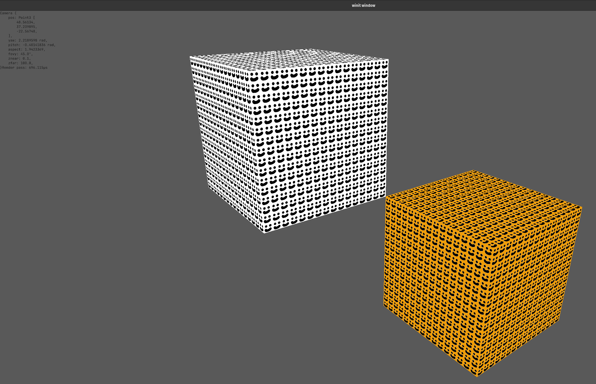

## Day 4
Today I wanted to get something a bit more interesting in my world, so it was time to tackle world gen!  

I found [this great video](https://www.youtube.com/watch?v=YyVAaJqYAfE) and [blog](https://www.alanzucconi.com/2022/06/05/minecraft-world-generation/) which goes through Minecraft's world generation and how it evolved over time.  

The basis of it is a [seedable random noise generation function](https://en.wikipedia.org/wiki/Perlin_noise), which basically means a parameterised function which maps an input (in this case x,y,z coordinates) to a random value between -1 and 1. The one I'll be using (Perlin noise) has some nice properties:  
1) You can apply it at a single point. This means that I can generate any place in the world at any time.  
2) It's locally smoothe, which results in nice terrain-like outputs.  
3) There's some parameters to tweak, so you can end up with nice rolling hills or jagged mountains.  
4) It's fast!  

I've implemented this algorithm many times in the past, so I'll be grabbing an off the shelf library this time [libnoise](https://docs.rs/libnoise/latest/libnoise/index.html).  
What I will be doing myself is layering multiple different generators together. This will let me have both coarse and fine detail in the terrain.  

To decide on what kinds of blocks will be created, I'm treating the noise output as a density. Where there is low density, there will be Air (i.e. no block), at medium density there will be dirt, and high will be stone. I'll refine the rules for this down the line, but this will give me something to start with.  

After playing around with the parameters for a while, I settled on something I liked. I want to go for something that feels like a big endless cavern, with lots of tunnels and crevices.  

Going from my toy chunks before to a "real" world immediately caused some issues. Each of my chunks has 4096 blocks in them. My camera has ~100 blocks view distance, so I thought creating chunks in a 16 chunk radius would be a good idea. This brought the number of blocks being rendered from 8192 to over 134 million! Which of course ground the game to a halt.  
If I was going to work with big worlds, then it was time to take a look at rendering performance.  

I really like performance optimisations. My day job is AI engineering, so I'm used to dealing with a lot of data processing. Typically performance improvements come down to a few options:  
1) Do less of the thing  
2) Do the same thing, but in a smarter way  
3) Do the thing on better hardware  
4) Do the thing in parallel  
5) Do a different thing that solves the same problem  

In my case, the rendering loop consisted of:  
1) Iterate over all of the blocks in the world
2) Create instance data (transformation, texture index) ready to be sent to the GPU
3) Copy the data over to the GPU
4) Draw the blocks to the screen

The obvious and most simple question to ask is "Do we need to render all the blocks at once?" and of course the answer is no. So I'm going to take perf opt #1 and smash everything I can with it.  

The first thing I did was to limit the candidate blocks to ones that it would be possible for the player to see. For this I simply skipped any chunks that were out of vision distance of the player, plus an extra chunk's distance just in case. This brought me down from 32768 chunks to just 2130 (~8.7m blocks). I decided not to go down to the block level, as it would mean millions of relatively expensive distance calculations for not a lot more shaved off.  

Secondly, I skipped rendering Air blocks (duh). This is about 50% of all blocks, so it brought the number down to ~4.4m.  

Finally, the player can never see a block unless they are exposed to the air. So I added a check for any adjacent block is of type Air. If any of them were, then the block is "exposed" and is rendered. I decided to skip checks for blocks at the edge of chunks, since that would add an extra hash per-block. This meant that the outside hull of each chunk was rendered, even if the blocks might be underground.  
This further shaved down the number of blocks to ~1.7m, which was just about renderable at single digit FPS.  

This still needs to come way down if I want a 3D world, so I'll focus more on it next time.  

Here's what that looks like (Only 2D plane of chunks to show a cross-section).  
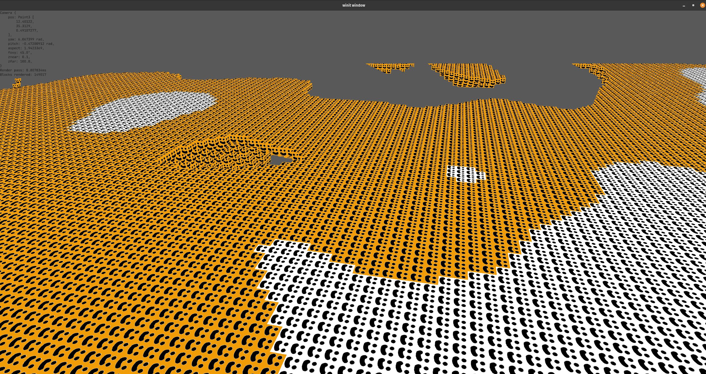

## Day 5
Today's goals
1) Continue on optimising the rendering loop  
2) Some basic collision detection  
3) Lighting  
4) On demand world generation  

Starting with the performance optimisations, I first applied a little bit of #2. Previously I was iterating over all chunks in the world and checking if they were within sight of the player. This is fine for a small world, but as we grow larger it scales with the number of generated chunks. I instead changed this over to generating some candidate chunk positions given the player's position, which scales with the vision range of the player, which in this case is constant. Realistically this didn't have much effect, but it's a bit more ergonomic and it's a check I'll want to have later on I'm sure.  

My 2nd one is back to rule #1, do less. Checking whether a block is exposed or not is relatively cheap on an individual block level, but adds up when it needs to be done for every block every frame. Realistically the world is not going to change very often (only when a chunk is generated, or when a block is broken/placed), so there's a lot of benefit in caching the exposure information and only re-calculating on a change.  
I added a new 3D array on the chunk to track whether a block is exposed. Since there's no interaction with the world right now, it is calculated once when a chunk is generated. In the rendering loop we just index into that array which is lightning fast.  

3rd, another "smarter" solution. Since I'm not updating exposure information every frame, I can use a more expensive method to give a better result. Where I previously assumed that blocks on the chunk boundaries are exposed, I now actually perform the check across chunk boundaries. This again reduces the number of blocks we end up rendering, from ~1.7m down to just 260k. The increased time spent on the check up front is noticable; there is a freeze for a few hundred miliseconds whenever a new set of chunks is generated. However it's worth it as the game sits at ~40 FPS when idle / looking around.

Moving on to collision detection, I opted for a very simple Axis-Aligned Bounding Box (AABB) approach. Since the world is made from cubes, the player probably is aswell. This made collision detection very straightforward - if the bboxes intersect, there's a collision. I changed the camera controller code around a bit so it first creates a "desired" movement vector based on the player's inputs, checks for collisions around the player, and if there is it nulls the movement in that direction. Having this in the controller also means that it's only checking for collisions whenever the player is moving rather than on every frame.  
One of the issues with this approach is that it only detects if the player is currently colliding with the terrain, rather than if they would collide with it after moving. When moving at high speeds this means that you can jam yourself into the ground before the collision detection kicks in. When moving slow it works fine though.  

For lighting I'm following along with the [Learn WGPU](https://sotrh.github.io/learn-wgpu/intermediate/tutorial10-lighting/#seeing-the-light) example. It's split into two parts; the first extends the existing texture shader to include lighting information. The 2nd is a new shader to draw the light source object.  

To draw the light source itself, I have a new shader which is a simpler version of the block rendering shader. Instead of taking in a texture, it draws a single colour. The result of this is a solid white block, from which the light is emitted.  
To apply the lighting to the rest of the world, I pass the position matrix and colour of the light block into the existing texture shader. The lighting calculations are split into 3 parts:
1) Ambient lighting: This is a baseline level of light that's applied to everything.  
2) Diffuse: Directional light applied from the light source.  
3) Specular: Reflections off objects back towards the camera. This one I skipped as I don't really care for reflections in my game.  

This kind of lighting works well for point source lights like lamps and torches, but it's not ideal for something like sunlight. I'll probably end up having 2 renderers, or treat the sun as a point light at a really far distance.  

On-demand world generation was pretty straight forward. I already had the chunk generation code, so it was just a matter of triggering that when the player moves in range of an un-generated chunk.  

Apart from this, I did a bunch of refactoring and cleanup. I introduced 3 coordinate systems: 1) Chunks (discrete) 2) Blocks (discrete) 3) World (continuous). This helped make things clearer when doing coordinate transformations. They're also backed by the [cgmath](https://docs.rs/cgmath/latest/cgmath/) library rather than hand-rolled vectors.  

Also I finally created some real block textures, so I've got dirt and stone now.  
Here's what everything looks like so far:  
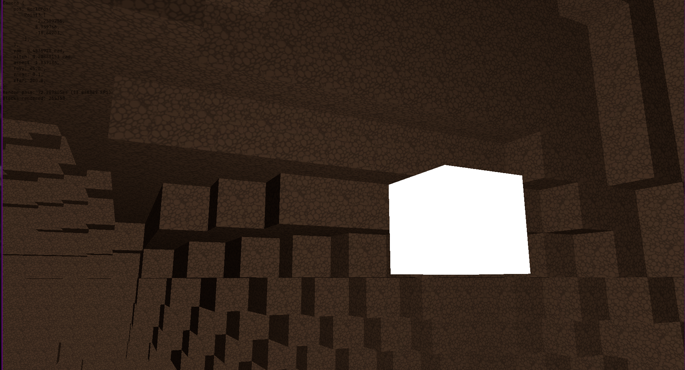  

## Day 6
Today's goal: Add a walking controller.  

Since I've got collisions working now, I can start working on more game-like movement. I started by abstracting out a CameraController interface, which takes user inputs and modifies the Camera accordingly.  
The walking controller was a bit more tricky than the flight controller as I had to take gravity into account. This controller allows the player to move horizontally, jump by applying an instant upwards force, and fall due to gravity applying downward force over time.  
I also had the idea to add a space-flight controller. This one is much more stateful than the others in that player input applies a force in that direction, and the internal velocity moves the player over time. The player's velocity decays over time due to drag/air resistance so they won't keep flying forever.  

Other than that, a bunch more refactoring & cleanup.  

## Day 7
Today: time to put in some UI  

I did some Claude-powered research on what's out there in terms of UI libraries for rust. An immediate mode GUI made the most sense to me since everything is driven by Winit's event loop already. Maybe down the line I'll look into a retained mode one if it makes the interactivity easier. I'll be using [egui](https://github.com/emilk/egui) as I've used it before and it's one of the most popular. It also has integration libraries for [WGPU](https://docs.rs/egui-wgpu/latest/egui_wgpu/) and [Winit](https://docs.rs/egui-winit/latest/egui_winit/).  

The render loop for the UI is pretty straight forward:
1) Create the UI using egui's normal syntax.  
2) Turn that into primatives to send to the GPU  
3) Send any new textures & primatives to the GPU  
4) Create & run a rendering pass  
5) Free up any unused textures  

egui\_wgpu has the nice feature of only generating the deltas for primatives. This means only changes in the UI are sent to the GPU each frame.  

For UI elements, I replaced my old manual debug text with a floating window. I also implemented a hotbar which will let the player use different things from their inventory quicly (place a block, use a tool, attack with a weapon, etc.). The player can use their mouse scroll (and eventually 0-9 keys when I get around to it) to select a different slot on the bar. I used my old smiley face textures as placeholders to show this functionality for now. Eventually I'll have the icon for whatever items the player has in there.  
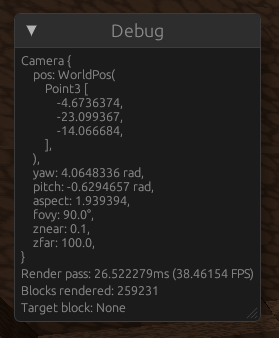  
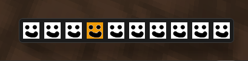  

By default the UI elements show up as draggable floating windows. I'll probably lock it to the bottom middle of the screen later.  

One quality of life thing that I've put off implementing until now was locking the cursor within the window. Previously the cursor was still visible while moving the camera around, and could move out of the window and lose focus. Now it's locked to the centre of the window and invisible, so it actually feels like you're controlling the game camera. It was a bit of a pain to get working since controlling the cursor is a platform-dependent thing, and if you do it wrong it'll just panic. In my case I'm running x11 on my laptop and Wayland on my PC. I've linked the cursor locking to the camera controller toggle I added in early in the project, so the player can toggle between "camera mode" and "UI mode".  

I also wanted to have some interaction with the world in the form of breaking blocks. First thing was to figure out what the player is looking at, which I did by shooting a ray out of the camera and seeing what it hits. I used the [Slab method](https://en.wikipedia.org/wiki/Slab_method) which is specific to AABB intersection, which makes it perfect for blocks. With the magic of Claude I implemented the algorithm which allows me to not only check which block is pointed at, but also where on the block. This'll be helpful down the line for block placing since I'll need to know which face the player is targeting. Since this check would need to be ran on all blocks, I first did a coarse AABB check on chunks, then processed chunks in ascending order of distance from the player.  

To give some visual feedback for the block that's highlighted, I'm just changing the block texture to a smiley face. Down the line I want to have a subtle highlight around the block's edges, which will probably be a new shader.  
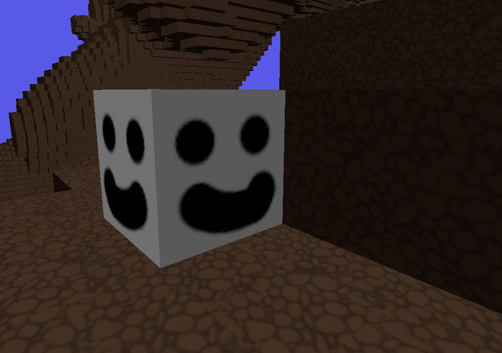  

I thought of another performance optimisation for the rendering (again a "do less"). Only blocks that are within the player's viewport could be candidates for rendering. I decided to do this at a chunk level by transforming the chunk position into [Normalised Device Coordintes](https://learnopengl.com/Getting-Started/Coordinate-Systems) and discarding ones that land outside the -1 - +1 bounding box. This reduced the blocks rendered only by about 10%, so I think there's a bug in the implementation.  

Anyway here is what the game looks like now:  
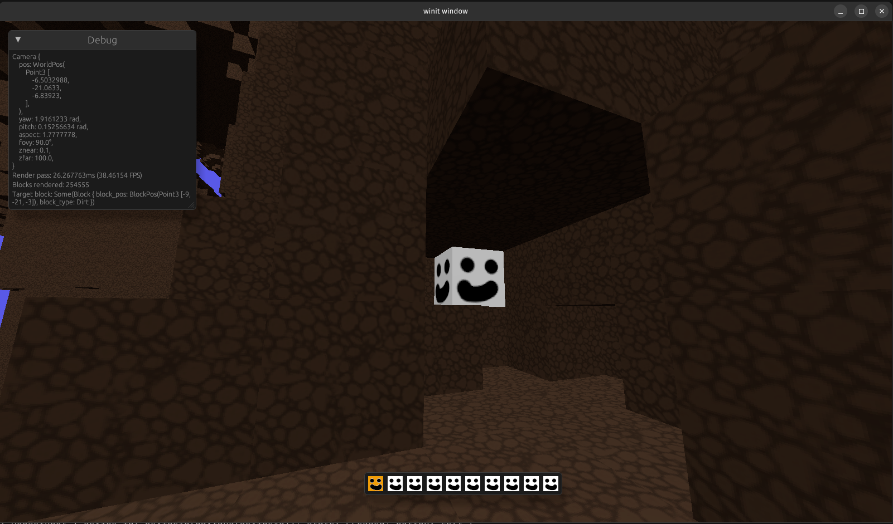  

## Day 8  
Today I was back home for the day, and while there I noticed a clay sculpture my sister had made a few years ago in art class. It's a bird made out of human features, named Sibeal.  
I knew I had to have it as my first monster in the game. I snapped a few photos on my phone and threw them into an AI picture -> 3D mesh converter I found online. After a few tries the result looked pretty decent. Unfortunately the actual mesh and texture was complete garbage. I spent the next 5 hours cleaning it up in blender (and learning blender) to a point where it was a reasonably small triangle count and all the normals were ok.  

Once I had the model, getting it into the game was fairly straight forward. I was able to re-use my rendering pipeline for blocks and just swap out the mesh & material.  
Here's what Sibeal looks like in the game:  
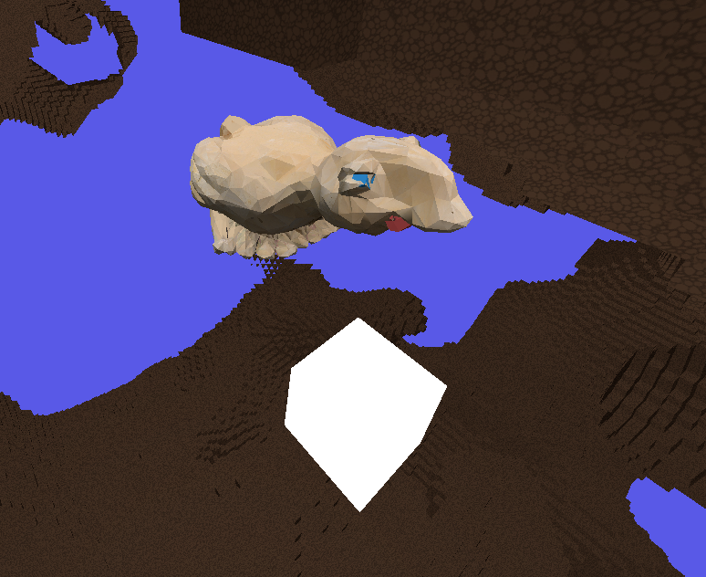  

When I get around to properly implementing entities, I'll spend some time on rigging and animations so it can walk around & run after the player.  

## Day 9  
Today's goals: Inventory system and improved hotbar.  

Last time I got the basics of a hotbar up and running, now I wanted to figure out how I actually wanted it to work. In many games, the hotbar is treated like another "separate" inventory or a sub-part of the inventory. For example in minecraft & Terraria, you drag items from your inventory onto your hotbar, and when you use up all of that item you get an empty slot. What always frustrated my about this was that say if you had some torches in your hotbar and you ran out, the placement is lost and next time you pick up some torches they'd need to be re-dragged onto the hotbar from your inventory.  
Instead I wanted to have the hotbar be a quick-access or favourited list of items in your inventory. It would have favourited items as placeholders, whether you actually had any of that item in your inventory or not. If you had some, then the slot would be highlighted & have an item count beside it. If you didn't, it would be desaturated but still be there. That way I can have my "torch slot" stick around when I run out.  
It also means that I can just worry about the inventory when it comes to item ownership, whereas the the hotbar is just a view ontop of it.  

For the inventory, there's a few styles I'm considering. In Minecraft, you have a fixed number of slots and items have a maximum stack size. In Path of Exile some items take up multiple slots so you have to play backpack tetris. In other games items have weight, and the player can only hold a maximum total weight.  
I decided to go with the latter approach. I don't really like the idea of trying to optimise for organising your inventory or throwing away small stacks of items to fit something else in. Having weight as a stat I can tweak would also open up the opportunity for a progression system. The player could get a backpack or train some strength skill stat to increase the weight they can carry. I could also make more valuable things heavier, and make quality of life things weigh nothing so the player doesn't feel punished for stocking up on torches or food for an extended trip.  

The inventory is simply a collection of item IDs and counts. It's rendered as a floating window in the middle of the screen, and items show up in a grid growing downwards. It took a good while of trying to fix the window size to find out that there's a [limitation in egui](https://github.com/emilk/egui/issues/498#issuecomment-1758462225). Luckily there's a simple workaround. I have the inventory only show up when the player is in the "UI mode".  
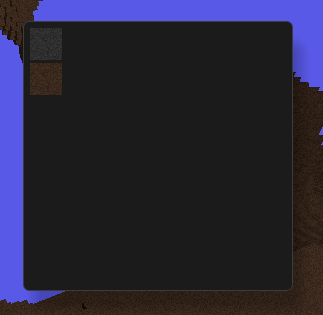  

Hotbar improvements were mainly visual. It's now centred at the bottom of the screen. I'm using real icons for filled slots, and the old placeholder smiley for empty slots. I also added a nice outline highlighted for the currently selected slot. I also added a "set favourite" function which will be used later on to let the player configure it. Right now there's no actual interaction between the inventory and the hotbar.  
  

I also abstracted out a "Drawable" interface for the UI elements which should let me modularise the UI behaviour easier.  

I introduced an Item data structure at this point aswell. Right now it's just associated with an ID and icon and align with the block types. I'm using Rust's [OnceLock](https://doc.rust-lang.org/stable/std/sync/struct.OnceLock.html) to make sure they're loaded once at startup and available globally.  
I'm not sure how I want to handle the relationship between in-world blocks and items yet. Should a block be its own thing, and breaking it produces an item? Or should the block be the in-world manifestation of an item? I'm leaning towards the former as there may be cases where I want non-reversable actions. For example breaking an ore with an end-game drill might produce multiple ore items, I wouldn't want the player to be able to have an infinite ore loop by placing them down as new ore blocks.  

## Day 10
Today's goals: Connecting the hotbar & inventory  

As I went through last time, I wanted my hotbar to be a view onto the inventory. I still wanted to keep the two structures separate, so the hotbar has a reference rather than ownership of the inventory. Unfortunately this doesn't play well with Rust's [borrowing rules](https://doc.rust-lang.org/book/ch04-02-references-and-borrowing.html#mutable-references), since I'll want to be modifying the inventory pretty often. The way around this is using [RefCell](https://doc.rust-lang.org/std/cell/index.html#refcellt) and [Rc](https://doc.rust-lang.org/std/rc/index.html) so that borrow and lifetime checks are moved to runtime. This doesn't mean I can violate the rules, it's just too difficult to express statically at compile time.  

I added some functionality on the inventory to add/remove items, and check how many of an item the player currently holds. This is used by the hotbar to check how many of a favourited item the player has.  
I extended the drawing functionality for both the inventory and hotbar to display that count:  
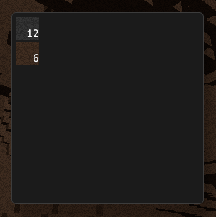  
  

I hooked up the previous breaking logic to also add a block of the corresponding type to the player's inventory. I also used the interection point from the target block detection from the other day to implement block placing (and also remove the block from the player's inventory).  

On the side, I put together a better stopwatch for debugging. It'll allow me to easily track multiple timings and get averages over the past few frames.  

I realised the world was looking pretty boring, the parameters I was using up until now for the perlin noise was resulting in very smooth open caverns.  
Instead of eyeballing it, I wanted to make a small tool to experiment quickly with different params. I shamelessly got Claude to whip something together, and after some fixes due to outdated libraries I got something nice running:  
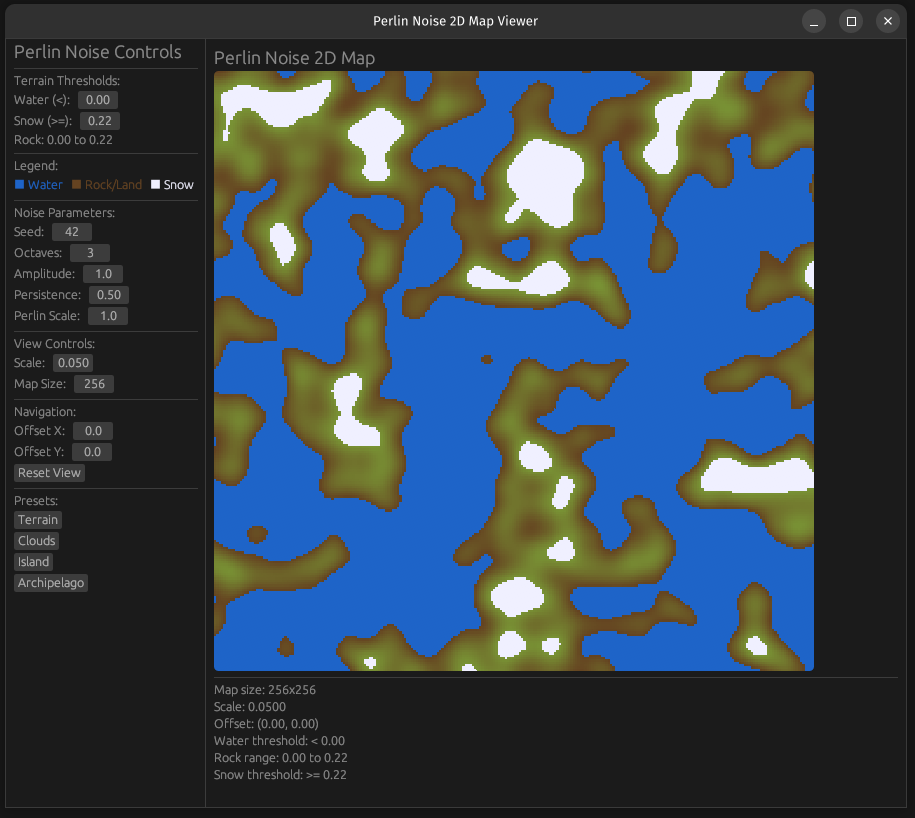  

I settled on something that was a bit more interesting, the open spaces are much tighter and there's more parts jutting out. The downside is that there's a lot more surface area, and thus a lot more blocks exposed and rendered. The FPS is sitting at around 20-30, so I'll probably have to go back to rendering optimisations again soon.  

Before:  
  

After:  
  

