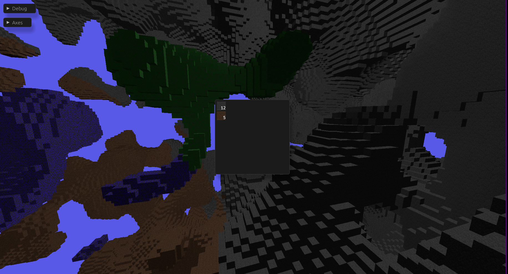

# Dev Log

## Day 1
Today's goal was to learn the basics of windowing & rendering in rust.  
I'm following along with the [Learn WGPU](https://sotrh.github.io/learn-wgpu/) and [Winit](https://docs.rs/winit/latest/winit/) tutorials.  

For my blocks, I'm rendering each face individually. Each face consists of 4 vertices in unit space, which are mapped to quick texture that I created in GIMP.  
To create a block, I'm creating 6 different instances of a face, which just transforms the face from unit-space into world space with a translation and rotation.  
So to create a simple 8x8x8 cube of blocks (which was about the limit where performance started to degrade), It's a total of 3072 faces being rendered.  

The render pipeline is pretty close to the Learn WGPU tutorial. It consists of:  
1) A handle to my GPU (or integrated graphics in the case of my laptop).  
2) A Winit window and drawable surface on it.  
3) A queue which is like a pipe to send commands to the GPU.  
4) A command encoder which translates the cross-platform commands into hardware-specific commands to be sent down the queue.  
5) A WGSL shader which runs on the GPU to do the drawing.  
6) Bind groups which allow you to group resources and swap them out easily during the rendering pass. The "layout" tells the shader code how the data buffers are interpreted, while the bind group itself links in the actual data buffers.  
7) A render pipeline, which is basically a combination of all of the above. You'd usually have one pipeline for each type of rendering you want to do. In my case a renderable in-world object.  

For the texture rendering, I've also got a depth buffer, which makes sure that objects are rendered in the right order. I don't think this prevents the GPU from actually doing the rendering, only that pixels are rendered in the right order, so it doesn't help much with performance.  

Since this is just a simple rendering MVP, I'm loading all of the data buffers onto the GPU up-front. In a real game I'll want to do this dynamically as the player moves around / interacts with the world.  
During the rendering pass which happens every frame, I first do some setup. 
1) I tell my encoder to start a new render pass, clearing the old screen and setting it to grey (my skybox colour). I also clear my depth buffer.  
2) I load up the render pipeline and bind groups for my textures and camera (will discuss camera later).  
3) I load up my data buffers. They're already on the GPU, they just need to be set as active.  
4) I send a draw command. This basically just executes the shader code on the loaded data.  

I also have some debug text that I want to draw on screen. Since I'm not using any sort of UI library, I'm just using [wgpu-text](https://github.com/Blatko1/wgpu-text).  
For now I'm just showing the camera variables, since it was a bit tricky to get the camera controller code right without visual feedback.  
The text render pass is a lot simpler, I just begin a new render pass, this time without clearing the screen, and the text.  

All of this so far has just been preparing actions for the GPU to do, it hasn't actually ran them. The last thing to do is to execute them by sending them to the queue.  
Side note: Interacting with a GPU is usually an async thing. The only async needed was to create the initial device handle, so I'm assuming that everything else is a blocking API abstracted away by WGPU. I'm using [Tokio](https://tokio.rs/) which is probably overkill, but I'm familiar with it and it might come back into play later when I want to do something like async world loading.  

Moving onto the camera then, I'm just doing a basic one that looks at the world origin and rotates around it, similar to say a 3D modelling tool.  
The state and behaviour of the camera are split out into a Camera (state) and CameraController (behaviour). This will let me swap them out easily for different types of movement, eg. walking around vs flying.  
During the rendering, the camera is turned into a [View-Projection Matrix](https://jsantell.com/model-view-projection/), which basically encodes all the transformations needed (translation, rotation, perspective) to go from world-space to camera-space into a single matrix. The cool thing about this is that you can [compose](https://en.wikipedia.org/wiki/Transformation_matrix#Composing_and_inverting_transformations) a complex chain of transformations into a single matrix up-front, then applying them to each object is constant time.  
The camera matrix is passed to the shader during the rendering pass to put objects in the right spot.  

For the camera controller, I'm using an extremely simple one. It uses WASD, space, Z to go in/out/up/down/left/right. Winit events are intercepted and passed to the controller if they're keyboard inputs.  

All in all pretty happy with day 1's progress. Got the basics of rendering and event handling sorted. Here's what the final result looks like:  


## Day 2
Today I wanted to do 2 things: 1) Improve the camera 2) Work with 3D models rather than creating blocks manually from faces.  

For the camera, I wanted to change the behaviour of the controller into something more fit for a game. So I decided to go for a simple flying style (think minecraft creative mode).  
Previously, my camera state was stored as a position and a "looking at" location. This is fine for an orbiting style camera like I had before, but for a player camera I switched to a position + pitch/yaw. This was easier to work with since I'd just be treating the mouse movement as angle deltas.  
One edge case I had to deal with was when the player looks straight up/down. When the up & looking at vectors are parallel things get funky with the calculations. Instead of actually dealing with this, I decided to just clmp the viewing angles so we wouldn't ever reach this state.  
To capture the mouse movements Winit has an AxisMotion event which tells you where the mouse has been moved to on each axis. I'm just mapping that to an angle delta in the controller.  
I also added a toggle button (Esc) for the controller. This will be used down the line to disable the camera movement when the player is in an interface like they're inventory.  

For the block modelling, it's following on to the end of the Learn WGPU tutorial. I'm using the [Wavefront OBJ](https://en.wikipedia.org/wiki/Wavefront_.obj_file) format, since it's human readable and most modelling software can export to it. It's a data file with the vertices, faces, normals, and texture coordinates for particular model. In my case it's a simple cube, so I got Claude to create one for me.  
There's also an associated [Material Template Library](https://en.wikipedia.org/wiki/Wavefront_.obj_file#Material_template_library) file, which defines textures, lighting, transparency, etc. For this I just pointed at my previous smiley face image.  
Other than loading the new model file, the rest of the process was fairly straight forward. I use [tobj](https://docs.rs/tobj/3.2.5/tobj/index.html) for loading the files, and then just create the vertex & index buffers from before.  

Result for today looks pretty much the same as yesterday. There's something funky going on with the block rendering, but that's a problem for next time.  


## Day 3
Today's goals:  
1) New block types  
2) A data structure for the world state, chunks, blocks, etc.  
3) Fix the rendering bug  

A voxel game is pretty boring if there's just a world full of one thing, so I wanted to have a way to easily extend to different block types. [Claude ended up helping me here](https://claude.ai/share/8320c181-b6b1-4ade-9cf5-b48b4e1399fe) by pointing towards 2D texture arrays. There are a similar enough concept to sprite sheets - a single texture that you index into.  
Extending my render pipeline to support texture arrays was trivial enough; Textures are packed into a single buffer, then indexed into by the shader by passing in the block ID as the index.  
The new block, creatively named smiley2, is just a re-coloured version of the original. I'm able to re-use the block mesh and just extend the MTL file with the new texture.  

Next it was time to tackle the world data. Since I want this to support very large (or infinite) worlds, chunking the world data was a no-brainer. This'll allow me to only load relevant parts of the world, and introduce a coarser granularity when doing various computations. I also didn't want to limit worlds to 2D, so my chunks will be cubes rather than vertically infinite chunks a-la minecraft.  
[Nice blog](https://0fps.net/2012/01/14/an-analysis-of-minecraft-like-engines/) on performance chararcteristics for voxel engines.  
When considering which data structures to choose, I'll consider a few access patterns:  
1) For the rendering pass, I'll need to visit every block so I don't want a bunch of expensive pointers or hashes.  
2) For player interactions, they'll likely be localised to around the player's position. So I'll need to be able to look up based on a position key.  
3) For block-block interactions, they'll likely be adjacent, so similar to #2  
4) Completely random access such as random events, monster spawns.  
5) Only loading needed chunks, which will be sparse.  

I decided to go with a HashMap for holding the chunks at a top level. This will allow me to have a sparse representation of loaded chunks. Hashing is pretty expensive in a hot loop, but I'm hoping I can minimise the number of chunk lookups I need to perform.  
For blocks within a chunk, I'll be storing them as a 3D array. This will allow very fast access once we're in the context of a chunk. It should also be the most compact way of storing the really granular block data.  
Here's how that'll look in terms of access:  
(C: Number of chunks, B: Number of blocks in a chunk)  
1) Iterating over all blocks: C + C * B iterations (No hash needed as we're just looping through all entries)  
2) Random access to a block: 1x hash, 1x array lookup  
3) Iterating over blocks around a given position: Small C (worst case 8 at the corner of a chunk) hashes + N array lookups depending on range  
4) Iterating over all blocks in a chunk: 1x hash + B iterations  

One variable to tweak is the size of the chunk. If it's too small, there will be too many hashes and slow things down. If it's too big, we're losing a lot of granularity for things like lazy loading. For now I'm going with a completely arbitrary 16x16x16.  

I had some WIP code from before to do loading/saving of worlds. Right now it just serialises each chunk to a binary file, then stores a world as a folder of chunk files.  

The rendering bug from last time ended up being simple. When moving from individual faces to the block mesh, I had forgot to change the instancing code. So for each block I was actually rendering 6 blocks in a 3d "+" shape.  

I also did a bunch of cleanup & refactoring, particularly with the rendering code as it was getting pretty unwieldy.  

Here's what today's result looks like, 2 chunks each made of a different block type.  


## Day 4
Today I wanted to get something a bit more interesting in my world, so it was time to tackle world gen!  

I found [this great video](https://www.youtube.com/watch?v=YyVAaJqYAfE) and [blog](https://www.alanzucconi.com/2022/06/05/minecraft-world-generation/) which goes through Minecraft's world generation and how it evolved over time.  

The basis of it is a [seedable random noise generation function](https://en.wikipedia.org/wiki/Perlin_noise), which basically means a parameterised function which maps an input (in this case x,y,z coordinates) to a random value between -1 and 1. The one I'll be using (Perlin noise) has some nice properties:  
1) You can apply it at a single point. This means that I can generate any place in the world at any time.  
2) It's locally smoothe, which results in nice terrain-like outputs.  
3) There's some parameters to tweak, so you can end up with nice rolling hills or jagged mountains.  
4) It's fast!  

I've implemented this algorithm many times in the past, so I'll be grabbing an off the shelf library this time [libnoise](https://docs.rs/libnoise/latest/libnoise/index.html).  
What I will be doing myself is layering multiple different generators together. This will let me have both coarse and fine detail in the terrain.  

To decide on what kinds of blocks will be created, I'm treating the noise output as a density. Where there is low density, there will be Air (i.e. no block), at medium density there will be dirt, and high will be stone. I'll refine the rules for this down the line, but this will give me something to start with.  

After playing around with the parameters for a while, I settled on something I liked. I want to go for something that feels like a big endless cavern, with lots of tunnels and crevices.  

Going from my toy chunks before to a "real" world immediately caused some issues. Each of my chunks has 4096 blocks in them. My camera has ~100 blocks view distance, so I thought creating chunks in a 16 chunk radius would be a good idea. This brought the number of blocks being rendered from 8192 to over 134 million! Which of course ground the game to a halt.  
If I was going to work with big worlds, then it was time to take a look at rendering performance.  

I really like performance optimisations. My day job is AI engineering, so I'm used to dealing with a lot of data processing. Typically performance improvements come down to a few options:  
1) Do less of the thing  
2) Do the same thing, but in a smarter way  
3) Do the thing on better hardware  
4) Do the thing in parallel  
5) Do a different thing that solves the same problem  

In my case, the rendering loop consisted of:  
1) Iterate over all of the blocks in the world
2) Create instance data (transformation, texture index) ready to be sent to the GPU
3) Copy the data over to the GPU
4) Draw the blocks to the screen

The obvious and most simple question to ask is "Do we need to render all the blocks at once?" and of course the answer is no. So I'm going to take perf opt #1 and smash everything I can with it.  

The first thing I did was to limit the candidate blocks to ones that it would be possible for the player to see. For this I simply skipped any chunks that were out of vision distance of the player, plus an extra chunk's distance just in case. This brought me down from 32768 chunks to just 2130 (~8.7m blocks). I decided not to go down to the block level, as it would mean millions of relatively expensive distance calculations for not a lot more shaved off.  

Secondly, I skipped rendering Air blocks (duh). This is about 50% of all blocks, so it brought the number down to ~4.4m.  

Finally, the player can never see a block unless they are exposed to the air. So I added a check for any adjacent block is of type Air. If any of them were, then the block is "exposed" and is rendered. I decided to skip checks for blocks at the edge of chunks, since that would add an extra hash per-block. This meant that the outside hull of each chunk was rendered, even if the blocks might be underground.  
This further shaved down the number of blocks to ~1.7m, which was just about renderable at single digit FPS.  

This still needs to come way down if I want a 3D world, so I'll focus more on it next time.  

Here's what that looks like (Only 2D plane of chunks to show a cross-section).  


## Day 5
Today's goals
1) Continue on optimising the rendering loop  
2) Some basic collision detection  
3) Lighting  
4) On demand world generation  


Starting with the performance optimisations, I first applied a little bit of #2. Previously I was iterating over all chunks in the world and checking if they were within sight of the player. This is fine for a small world, but as we grow larger it scales with the number of generated chunks. I instead changed this over to generating some candidate chunk positions given the player's position, which scales with the vision range of the player, which in this case is constant. Realistically this didn't have much effect, but it's a bit more ergonomic and it's a check I'll want to have later on I'm sure.  

My 2nd one is back to rule #1, do less. Checking whether a block is exposed or not is relatively cheap on an individual block level, but adds up when it needs to be done for every block every frame. Realistically the world is not going to change very often (only when a chunk is generated, or when a block is broken/placed), so there's a lot of benefit in caching the exposure information and only re-calculating on a change.  
I added a new 3D array on the chunk to track whether a block is exposed. Since there's no interaction with the world right now, it is calculated once when a chunk is generated. In the rendering loop we just index into that array which is lightning fast.  

3rd, another "smarter" solution. Since I'm not updating exposure information every frame, I can use a more expensive method to give a better result. Where I previously assumed that blocks on the chunk boundaries are exposed, I now actually perform the check across chunk boundaries. This again reduces the number of blocks we end up rendering, from ~1.7m down to just 260k. The increased time spent on the check up front is noticable; there is a freeze for a few hundred miliseconds whenever a new set of chunks is generated. However it's worth it as the game sits at ~40 FPS when idle / looking around.

Moving on to collision detection, I opted for a very simple Axis-Aligned Bounding Box (AABB) approach. Since the world is made from cubes, the player probably is aswell. This made collision detection very straightforward - if the bboxes intersect, there's a collision. I changed the camera controller code around a bit so it first creates a "desired" movement vector based on the player's inputs, checks for collisions around the player, and if there is it nulls the movement in that direction. Having this in the controller also means that it's only checking for collisions whenever the player is moving rather than on every frame.  
One of the issues with this approach is that it only detects if the player is currently colliding with the terrain, rather than if they would collide with it after moving. When moving at high speeds this means that you can jam yourself into the ground before the collision detection kicks in. When moving slow it works fine though.  

For lighting I'm following along with the [Learn WGPU](https://sotrh.github.io/learn-wgpu/intermediate/tutorial10-lighting/#seeing-the-light) example. It's split into two parts; the first extends the existing texture shader to include lighting information. The 2nd is a new shader to draw the light source object.  

To draw the light source itself, I have a new shader which is a simpler version of the block rendering shader. Instead of taking in a texture, it draws a single colour. The result of this is a solid white block, from which the light is emitted.  
To apply the lighting to the rest of the world, I pass the position matrix and colour of the light block into the existing texture shader. The lighting calculations are split into 3 parts:
1) Ambient lighting: This is a baseline level of light that's applied to everything.  
2) Diffuse: Directional light applied from the light source.  
3) Specular: Reflections off objects back towards the camera. This one I skipped as I don't really care for reflections in my game.  

This kind of lighting works well for point source lights like lamps and torches, but it's not ideal for something like sunlight. I'll probably end up having 2 renderers, or treat the sun as a point light at a really far distance.  

On-demand world generation was pretty straight forward. I already had the chunk generation code, so it was just a matter of triggering that when the player moves in range of an un-generated chunk.  

Apart from this, I did a bunch of refactoring and cleanup. I introduced 3 coordinate systems: 1) Chunks (discrete) 2) Blocks (discrete) 3) World (continuous). This helped make things clearer when doing coordinate transformations. They're also backed by the [cgmath](https://docs.rs/cgmath/latest/cgmath/) library rather than hand-rolled vectors.  

Also I finally created some real block textures, so I've got dirt and stone now.  
Here's what everything looks like so far:  
  

## Day 6
Today's goal: Add a walking controller.  

Since I've got collisions working now, I can start working on more game-like movement. I started by abstracting out a CameraController interface, which takes user inputs and modifies the Camera accordingly.  
The walking controller was a bit more tricky than the flight controller as I had to take gravity into account. This controller allows the player to move horizontally, jump by applying an instant upwards force, and fall due to gravity applying downward force over time.  
I also had the idea to add a space-flight controller. This one is much more stateful than the others in that player input applies a force in that direction, and the internal velocity moves the player over time. The player's velocity decays over time due to drag/air resistance so they won't keep flying forever.  

Other than that, a bunch more refactoring & cleanup.  

## Day 7
Today: time to put in some UI  

I did some Claude-powered research on what's out there in terms of UI libraries for rust. An immediate mode GUI made the most sense to me since everything is driven by Winit's event loop already. Maybe down the line I'll look into a retained mode one if it makes the interactivity easier. I'll be using [egui](https://github.com/emilk/egui) as I've used it before and it's one of the most popular. It also has integration libraries for [WGPU](https://docs.rs/egui-wgpu/latest/egui_wgpu/) and [Winit](https://docs.rs/egui-winit/latest/egui_winit/).  

The render loop for the UI is pretty straight forward:
1) Create the UI using egui's normal syntax.  
2) Turn that into primatives to send to the GPU  
3) Send any new textures & primatives to the GPU  
4) Create & run a rendering pass  
5) Free up any unused textures  

egui\_wgpu has the nice feature of only generating the deltas for primatives. This means only changes in the UI are sent to the GPU each frame.  

For UI elements, I replaced my old manual debug text with a floating window. I also implemented a hotbar which will let the player use different things from their inventory quicly (place a block, use a tool, attack with a weapon, etc.). The player can use their mouse scroll (and eventually 0-9 keys when I get around to it) to select a different slot on the bar. I used my old smiley face textures as placeholders to show this functionality for now. Eventually I'll have the icon for whatever items the player has in there.  
  
  

By default the UI elements show up as draggable floating windows. I'll probably lock it to the bottom middle of the screen later.  

One quality of life thing that I've put off implementing until now was locking the cursor within the window. Previously the cursor was still visible while moving the camera around, and could move out of the window and lose focus. Now it's locked to the centre of the window and invisible, so it actually feels like you're controlling the game camera. It was a bit of a pain to get working since controlling the cursor is a platform-dependent thing, and if you do it wrong it'll just panic. In my case I'm running x11 on my laptop and Wayland on my PC. I've linked the cursor locking to the camera controller toggle I added in early in the project, so the player can toggle between "camera mode" and "UI mode".  

I also wanted to have some interaction with the world in the form of breaking blocks. First thing was to figure out what the player is looking at, which I did by shooting a ray out of the camera and seeing what it hits. I used the [Slab method](https://en.wikipedia.org/wiki/Slab_method) which is specific to AABB intersection, which makes it perfect for blocks. With the magic of Claude I implemented the algorithm which allows me to not only check which block is pointed at, but also where on the block. This'll be helpful down the line for block placing since I'll need to know which face the player is targeting. Since this check would need to be ran on all blocks, I first did a coarse AABB check on chunks, then processed chunks in ascending order of distance from the player.  

To give some visual feedback for the block that's highlighted, I'm just changing the block texture to a smiley face. Down the line I want to have a subtle highlight around the block's edges, which will probably be a new shader.  
  


I thought of another performance optimisation for the rendering (again a "do less"). Only blocks that are within the player's viewport could be candidates for rendering. I decided to do this at a chunk level by transforming the chunk position into [Normalised Device Coordintes](https://learnopengl.com/Getting-Started/Coordinate-Systems) and discarding ones that land outside the -1 - +1 bounding box. This reduced the blocks rendered only by about 10%, so I think there's a bug in the implementation.  

Anyway here is what the game looks like now:  
  

## Day 8  
Today I was back home for the day, and while there I noticed a clay sculpture my sister had made a few years ago in art class. It's a bird made out of human features, named Sibeal.  
I knew I had to have it as my first monster in the game. I snapped a few photos on my phone and threw them into an AI picture -> 3D mesh converter I found online. After a few tries the result looked pretty decent. Unfortunately the actual mesh and texture was complete garbage. I spent the next 5 hours cleaning it up in blender (and learning blender) to a point where it was a reasonably small triangle count and all the normals were ok.  

Once I had the model, getting it into the game was fairly straight forward. I was able to re-use my rendering pipeline for blocks and just swap out the mesh & material.  
Here's what Sibeal looks like in the game:  
  

When I get around to properly implementing entities, I'll spend some time on rigging and animations so it can walk around & run after the player.  

## Day 9  
Today's goals: Inventory system and improved hotbar.  

Last time I got the basics of a hotbar up and running, now I wanted to figure out how I actually wanted it to work. In many games, the hotbar is treated like another "separate" inventory or a sub-part of the inventory. For example in minecraft & Terraria, you drag items from your inventory onto your hotbar, and when you use up all of that item you get an empty slot. What always frustrated my about this was that say if you had some torches in your hotbar and you ran out, the placement is lost and next time you pick up some torches they'd need to be re-dragged onto the hotbar from your inventory.  
Instead I wanted to have the hotbar be a quick-access or favourited list of items in your inventory. It would have favourited items as placeholders, whether you actually had any of that item in your inventory or not. If you had some, then the slot would be highlighted & have an item count beside it. If you didn't, it would be desaturated but still be there. That way I can have my "torch slot" stick around when I run out.  
It also means that I can just worry about the inventory when it comes to item ownership, whereas the the hotbar is just a view ontop of it.  

For the inventory, there's a few styles I'm considering. In Minecraft, you have a fixed number of slots and items have a maximum stack size. In Path of Exile some items take up multiple slots so you have to play backpack tetris. In other games items have weight, and the player can only hold a maximum total weight.  
I decided to go with the latter approach. I don't really like the idea of trying to optimise for organising your inventory or throwing away small stacks of items to fit something else in. Having weight as a stat I can tweak would also open up the opportunity for a progression system. The player could get a backpack or train some strength skill stat to increase the weight they can carry. I could also make more valuable things heavier, and make quality of life things weigh nothing so the player doesn't feel punished for stocking up on torches or food for an extended trip.  

The inventory is simply a collection of item IDs and counts. It's rendered as a floating window in the middle of the screen, and items show up in a grid growing downwards. It took a good while of trying to fix the window size to find out that there's a [limitation in egui](https://github.com/emilk/egui/issues/498#issuecomment-1758462225). Luckily there's a simple workaround. I have the inventory only show up when the player is in the "UI mode".  
  

Hotbar improvements were mainly visual. It's now centred at the bottom of the screen. I'm using real icons for filled slots, and the old placeholder smiley for empty slots. I also added a nice outline highlighted for the currently selected slot. I also added a "set favourite" function which will be used later on to let the player configure it. Right now there's no actual interaction between the inventory and the hotbar.  
  

I also abstracted out a "Drawable" interface for the UI elements which should let me modularise the UI behaviour easier.  

I introduced an Item data structure at this point aswell. Right now it's just associated with an ID and icon and align with the block types. I'm using Rust's [OnceLock](https://doc.rust-lang.org/stable/std/sync/struct.OnceLock.html) to make sure they're loaded once at startup and available globally.  
I'm not sure how I want to handle the relationship between in-world blocks and items yet. Should a block be its own thing, and breaking it produces an item? Or should the block be the in-world manifestation of an item? I'm leaning towards the former as there may be cases where I want non-reversable actions. For example breaking an ore with an end-game drill might produce multiple ore items, I wouldn't want the player to be able to have an infinite ore loop by placing them down as new ore blocks.  


## Day 10
Today's goals: Connecting the hotbar & inventory  

As I went through last time, I wanted my hotbar to be a view onto the inventory. I still wanted to keep the two structures separate, so the hotbar has a reference rather than ownership of the inventory. Unfortunately this doesn't play well with Rust's [borrowing rules](https://doc.rust-lang.org/book/ch04-02-references-and-borrowing.html#mutable-references), since I'll want to be modifying the inventory pretty often. The way around this is using [RefCell](https://doc.rust-lang.org/std/cell/index.html#refcellt) and [Rc](https://doc.rust-lang.org/std/rc/index.html) so that borrow and lifetime checks are moved to runtime. This doesn't mean I can violate the rules, it's just too difficult to express statically at compile time.  

I added some functionality on the inventory to add/remove items, and check how many of an item the player currently holds. This is used by the hotbar to check how many of a favourited item the player has.  
I extended the drawing functionality for both the inventory and hotbar to display that count:  
  
  

I hooked up the previous breaking logic to also add a block of the corresponding type to the player's inventory. I also used the interection point from the target block detection from the other day to implement block placing (and also remove the block from the player's inventory).  

On the side, I put together a better stopwatch for debugging. It'll allow me to easily track multiple timings and get averages over the past few frames.  

I realised the world was looking pretty boring, the parameters I was using up until now for the perlin noise was resulting in very smooth open caverns.  
Instead of eyeballing it, I wanted to make a small tool to experiment quickly with different params. I shamelessly got Claude to whip something together, and after some fixes due to outdated libraries I got something nice running:  
  

I settled on something that was a bit more interesting, the open spaces are much tighter and there's more parts jutting out. The downside is that there's a lot more surface area, and thus a lot more blocks exposed and rendered. The FPS is sitting at around 20-30, so I'll probably have to go back to rendering optimisations again soon.  

Before:  
  

After:  
  

## Day 11
Today's goal: rendering opt

After yesterday's world gen changes I'm sitting at around 400k blocks being rendered. The vast majority of these will be obscured to the camera, like underground caves. I don't want to go down the route of ray tracing yet, so I decided to roll my own depth testing. This works by first transforming blocks into NCD space, then getting the 2D bounding box facing the player and its distance. After sorting by distance, the blocks are processed incrementally and casts its "shadow" onto blocks further away. Blocks which are fully in a shadow are eliminated from rendering.  
Unfortunately the time spent doing this check was far more expensive than just rendering the blocks, and didn't end up eliminating as many blocks as I expected.  

During this I wanted to have some better handling of derived variables like the camera's view-model projection. Right now I'm updating it in the camera controller whenever I make a change. There's a few properties I was looking for:  
1) I want it to be transparent to whatever is making the change. They should be able to change the camera and not have to worry about also updating the derived thing.  
2) I want it to be lazily evaluated. If I update the camera 100 times per update frame, but only read the VMP matrix once, then I don't want to re-calculate it every time.  
3) If there's no change, then it shouldn't be recalculated.  
4) Only the things that have changed should be recalculated. Eg. for a DAG of derived variables, only the minimum subgraph should be calculated.  

I found [sycamore-reactive](https://github.com/sycamore-rs/sycamore/tree/main/packages/sycamore-reactive), which is a sub-package of the Sycamore web framework for reactive primatives. It's not well documented, but it seems to be close to what I want. The pain is that every variable, either "raw" or derived, needs to be wrapped in another struct. Also the whole app needs to be wrapped in its own event loop. I'm also not a massive fan of the ergonomics of setting/getting variables. I'm going to use it for the time being for the camera, but will probably end up ditching it down the line.  

## Day 12
Today is rendering opt part 2  

I found the bug in the "is in view" check which I introduced a few days ago. Instead of checking if a point was within the NDC box, I was checking if it was within any two of the axis planes. After the fix, I immediately ran into an issue with how I was culling chunks. By only checking whether a vertex lies within the NDC, I miss the case where the player is really close to a chunk, and the NDC is inside the chunk's AABB. This resulted in chunks disappearing when getting too close, which obviously isn't great.  
  

To really nail this check, I need to see if any part of the chunk intersects with the NDC box. Unfortunately the NDC transform turns straight lines into hyperbolae, so the check becomes extremely complicated. Instead I'll be trying [Frustum](https://bruop.github.io/frustum_culling/) [Culling](https://learnopengl.com/Guest-Articles/2021/Scene/Frustum-Culling), which seems to be the go-to for this kind of thing. It involves checking against each of the linear planes of the frustum, which is pretty quick.  
I first generated this code with Claude, but I ended having to re-write it from scratch as it got it wrong but I couldn't figure out where. It took me longer than I'd like to admit to finally get the maths right. I spent about 2 hours debugging a single missing "-".  
After adding this, it brought down the number of blocks rendered by up to 70% depending on where I was looking. In some directions it seemed to still load all the chunks, so I'm not convinced it's working 100% correct yet.  

## Day 13
Today I got the frustum culling completely sorted. The final piece was a mis-calculation of the chunk AABB. With everything fixed, my render loop is down under 20ms per frame (50-60 FPS) and hovering around 100k blocks rendered.  

One thing that's become abundantly clear to me is that I don't have great tools to debug issues with geometry, so I think I'll tackle this next. There's a few things that would be useful:  
1) A visualisation of the world axes relative to my camera position.  
2) A wireframe of the viewport frustum, although I don't be able to show my camera's current one, I want to be able to place one in the world.  
3) Wireframes for the chunk boundaries and maybe blocks.  

I'll implement the wireframes as a new shader. It might also be a good chance to improve the visual feedback for player's target block. I'd like to show a subtle highlight around the edges so the player can still tell the type of block it is.  

I added the axis visualisation as another floating window that can be hidden. It works by shooting a ray out from the camera towards the window's centre and placing a fake set of origin vectors in the world at that point. The camera MVP transformation is applied to project them back onto the screen space. This not only means I get correct axes for the camera's position and angle, but also the exact position on the screen where the axes are drawn.  
  

I'll come back to the wireframes another time, for now I wanted to take a look at the world generation and make it a bit more interesting. So far I've just been treating the perlin noise as a sort of density. When there's low it's air, medium it's dirt, and high it's stone. This did the job as a basic framework to work with, but with only one axis of variation it's still pretty boring.  
If I layer several random noise generators together on different axes, then I with just a handful I can generate an exponential amount of variation. Some layers I'm thinking of at the moment:  
1) Density as an alternative to height in a 2D world, since mine is infinite in all directions. I can use this to control the size of caves, and different mineral layers as the player digs into the surface. I could also have black holes at the extremes. 
2) Moisture, which I can use to move between deserts, oceans, swamps, etc.  
3) Temperature
4) "Influence" which is a bit nebulous. I'm taking inspiration from Path of Exile's influence system, where different regions are controlled by different bosses/gods/eldritch monsters/etc. I could use this as a progression axis to generate areas with tougher monsters and higher level materials.  
5) Other "one-hot" axes which control the existence of something in particular independent of the other axes. eg. radioactivity might make a region dangerous to inhabit, but juice up monsters the monsters that would usually live there.  

I want to combine all of these axes to create biomes, rather than just having some discrete random biomes. This should give more natural transitions between areas. This is how the biome system in minecraft works (see the video from a few days back).  
For now I've just added some new blocks, and a 2nd noise layer controllering 3 descrete biomes: DirtLand, StoneLand, and DenseCaves. Here's two new blocks (void and radioactive stone) which spawn at very low densities in the dirt and stone lands respectively:  
  


## Day 14
One thing that's been bugging me is the stop-the-world freeze whenever new chunks are generated. This happens because when the player crosses the distance to generate a new chunk, it triggers generation for an entire 2D plane of chunks all at once. The way I want to solve this in the long term is by having chunk generation (and loading) happen asynchronously from the main game loop. In the short term however, I'm just going to ammortise the generation over several frames. The way I'll do this is actually to generate *more* chunks around the player, but past the vision threshold I'll give them only a chance of generating. That way by the time the player gets into range, the majority of the chunks will have already been loaded. I set the outer 2 chunk radius a 10% chance of generating per frame, and it *just worked*.  


I noticed while playing with my perlin map tool that when I added more octaves (noise layers) to the generation, it biased more around 0, and thus generated a lot less blocks at the extremes. I realised that I neglected what I learned back in statistics 101 class, and that's the formula for the [sum of normally distributed random variables](https://en.wikipedia.org/wiki/Sum_of_normally_distributed_random_variables). In order to preserve the same variance, the weights vector must have magnitude 1.  

Before:  
  

After:  
  

Perlin noise is roughly normally distributed, so using the outputs as thresholds to generate differnt types of blocks can be difficult as the values don't directly relate to a sense of rarity. I want to transform this back into a uniform distribution so I can easily set things like "this rare ore should be 1% of the total blocks generated in this region.". Doing this transformation at sampling time will be expensive (lots of logs / exponentials), so instead I'll be transforming the thresholds onto the z-space. Since it's only approximately normal, I plan to pre-compute a transformation based on the experimental distribution. Here's some stats on sampling a perlin function (n=1 million):  

50%: -0.0006854611653989897  
55%: 0.033480444761113046  
60%: 0.06830668469368939  
70%: 0.142237558033643  
80%: 0.22778642752324058  
90%: 0.34350776354220014  
95%: 0.43418983172157277  
99%: 0.5906519015332917  
99.9%: 0.7510765681834886  
99.99%: 0.8701822203744498  
99.999%: 0.9642774419871061  

These stats are independent of the parameters and number of octaves used.  

With this, I'm able to more directly describe the distributions of block types in my world and have that translated to the appropriate Perlin values with relatively little overhead. Since everything is constant, I'm hoping rust can compile away all of the abstractions and truly have it zero-cost.  

Here's what the terrain looks like now, I'm pretty happy with it for now:  


## Day 15
Today: Wireframe shader for targeted block highlighting  

I'm going to implement a generic wireframe shader which I can pass a set of lines in world space. I was going to use a geometric shader to render a block wireframe given a block position, but I might want to use the wireframes for other things down the line.  
My shader renders line primatives rather than triangles, and for now I've just hard-coded the vertices & indices for the block. I'll move this to a data file soon. Here's what it looks like:  
  

Now that I have most of the outstanding niggles dealt with, I wanted to go back and take a look at how I'm representing the game data, namely blocks and items. Since I'm focusing on creating a game engine rather than an actual game, I want to pull out the specifics about items and blocks so that users can easily extend or modify them. In particular I want a central place where things like icons/textures, physical attributes of blocks, on-break events, links between in-world blocks and items, etc... are defined.  
What I want to avoid at all costs is runtime dynamic dispatch as this will end up hitting performance badly in hot paths. I also want to avoid explit numeric or string IDs as they circumvent the benefits of Rust's type system. So I'll be opting for enums as the main identifier system here.  
I found [this cool crate](https://docs.rs/enum-map/2.7.3/enum_map/index.html) which provides an array indexable by an enum. This not only gives me the semantics I want, it's also much much faster as it avoids using a hashmap for lookups.  
During the large refactor, I also changed how blocks are stored from a `BlockType` to an `Option<BlockType>`, which makes dealing with empty space (previously `BlockType::Air`) much more explicit. The world generation code was also brought out and made generic. At some point during this last part there was a performance regression and the render loop is taking 3x as long. But that's a problem for tomorrow.  


## Day 16
Short day investigating the performance hit from last time.  
I've ruled out that it's due to extra memory overhead of the `Option`, as rust has a [nice optimisation](https://www.0xatticus.com/posts/understanding_rust_niche/) which cant fit Option<T> into a single byte.  
I've ruled out the overhead due to runtime loading of block data with `OnceCell`, with Claude calling it "essentially free" with ~0.1ns overhead per `.get()` call.  
My best guess is there's some overhead due to handling the wrapped option in the hot loop. There's a couple places where I'm converting `&Option<BlockType>` -> `Option<&BlockType>`, unwrapping to get the raw `BlockType`, etc.  

I tried some performance profiling with [cargo flamegraph](https://github.com/flamegraph-rs/flamegraph) to see where the increased time is spent. However rust's incredibly aggressive inlining in release mode meant that the flamegraphs didn't give much insight. Debug profile is essentially useless as there's so much performance hit from not inlining a lot of these lower level math functions.  

A big mistake I made last time was having one massive commit with both a refactor and a few of these new changes. I'm not able to step through the changes atomically to see where the hit was introduced. I think my best bet is to revert back to before yesterday and re-implement the changes one by one. I also thing I'll end up going back to a flat enum for `BlockType`, reintroducing `Air` as a type. It also means I'll be able to have more transparent block types down the line rather than an "empty" block.  


## Day 17
I've started reverting some of the changes from last time. First off I've reverted from `Option<BlockType>` to `BlockType`. I've instead added a `BlockData.renderable` flag which can be user defined. As I suspected, this didn't have any impact on performance, still sitting at ~30ms for the block elimination step.  
As an aside, I took some time to address a lot of the clippy warnings for unused variables. This'll reduce the noise in error messages going forward.  

I decided to do what I should have done in the first place and do an ablation test with all of the steps during block elimination. To my surprise the time spiked from 8ms -> 32ms just at the exposure check, which I didn't touch during the refactoring. I assumed this means that the functions are not being inlined given they're either simple math operations or array lookups.  
To find out, I found the [cargo-show-asm](https://github.com/pacak/cargo-show-asm) tool, which lets me dump out the generated assembly. I found lines like `call qword ptr [rip + game_engine::world::BlockPos::to_chunk_offset@GOTPCREL]`, which is a function call. After annotating the function with `#[inline(always)]` it disappeared. I repeated this across a lot of the small hot-path functions, and ended up almost completely eliminating the overhead introduced, and I'm back down to ~11ms per frame.  
I'm not sure why it suddenly stopped being inlined, my guess it's due to the introduction of the generic `ChunkGenerator` parameter on the `RenderState`. According to [this](https://std-dev-guide.rust-lang.org/policy/inline.html) I shouldn't need to do this when generics are in play.  


## Day 18
Now that performance is back at a good level, it's time to come back to the UI.  
I want to allow the player to customise their favourited items by hovering over the item in their inventory and pressing the correspoding button. One thing I'm immediately running into is that my previous separation of the Hotbar and Inventory data structures make it difficult to have one affect the state of the other (and especially in both directions). One way I could solve this is replicating the `Rc<RefCell>` approach which I have for the Hotbar -> inventory link. This would mean they both have a reference to each other, which rubs me the wrong way.  
Another one I'm thinking of which might be a bit cleaner is a Kafka-style event queue. I could have interactions with UI emit an event to the queue, then at the start of each frame I could process the queue to update the game state. This might make other events down the line easier to implement while maintaining separation between the components.  
One worry I have with the second approach is conflicting events. For example, two events might be emitted which were valid for the game state at the time. After the first event is processed, the second event may be invalid. I'll probably just use a first-come first-served approach, discarding later events that cannot be processed.  
I came across [this](https://gamedev.stackexchange.com/questions/7718/event-driven-communication-in-a-game-engine-yes-or-no) Stack Overflow question which suggests an event queue system works well for games.  


## Day 19 
I've gone down the rabbit hole with the message queue. In order to make dispatching the events to subscribers as efficient as possible, I wanted to use an enum array to do static dispatch. However the `enum_map` crate has a different behaviour for variants with data than I want. I only ever want to index based on the top-level variant identifier. This led me down the path of implementing my own enum arrays, proc macros, const generics and lots of unstable features. The result is something I'm pretty happy with. One thing that is bugging me right now is that I can't index into the array without a fully instantiated variant. So down the line if I wanted to set a subscriber to a `EnemyDied { .. }` event, I have to provide a concrete variant with data in it.  


## Day 20
Still on the topic of message queues. This time I'm trying to tackle how I can subscribe to different events with handers for each `GameState` component. My first idea was to encapsulate these in the `MessageQueue` struct, having a list of messages and a list of subscribers. It would then drive the execution by calling the subscriber handling function with each message. 
Unfortunately I ran into a lot of problems when trying to hold callback-like handler functions as they had references to the game state objects. I tried for a while to get around this by moving the reference ownership elsewhere, however this seems to all fall under Rust's rule of not having [self-referential structs](https://arunanshub.hashnode.dev/self-referential-structs-in-rust).  
Another way I could solve this is slapping Rc<RefCell<>> on every past of my game state, but I really want to avoid this because it means I'll have to deal wth the `.borrow()` / `.borrow_mut()` at every point I touch state which will be cumersome as hell.  
I think most likely what I'll end up doing is splitting the responsibiity. I'll implement the handling logic via a `Subscriber` trait on each game state object. I'll have the message queue at the top level, then manually manage a big matching function which dispatches to all the subscribers.

Now that I have a simple message queue, I can go back to what I actually wanted to implement: item favouriting in the inventory window. I'm doing this by detecting when a player hovers over an item and presses one of the hotbar keys. This triggers a message to the queue, which updates the hotbar in the next game tick.  


## Day 21
Now that I have my basic inventory system and block breaking/building, I want the player to be able to do interesting stuff with the things they dig up. It's time to implement crafting!  

There's a few different systems I've seen across games I've played:  
1) In minecraft, the crafting is "shaped". This means that depending on how you organise the ingredients in the crafting window, it produces a different think. One example is a door, which is a vertical 2x3 of wood blocks, vs a pressure plate, which is a horizontal 3x2 of wood. There's also different placeable workstations which allow you to craft different types of things; a furnace for smelting ores, an anvil for repairing equipment, and so on.  
2) In [Core Keeper](https://core-keeper.fandom.com/wiki/Crafting), there are several different types of crafting stations for different types ofcrafting. Additionally, there are several "tiers" of crafting, each locked behind a type of material harvestable by the tier below.  
3) In Terraria, crafting stations are non-interactive. Instead they allow players to craft new things in their inventory when they are in the vicinity. Chests in terraria act similarly, allowing players to craft with items contained in them without manually transferring them to their inventory. This encourages having dedicated [crafting rooms](https://terraria.fandom.com/wiki/Guide:Crafting_101) where lots of stations and chests are nearby.  
4) A lot of survival RPGs like Valheim also have a crafting time where the player needs to wait for the items to be crafted. I'm not a huge fan of this as the player usually can't do anything while this is happening.  
5) Some games also have prerequisites before a player can craft certain items. [RuneScape](https://oldschool.runescape.wiki/w/Crafting) locks crafting behind skill levels. Others have [recipes](https://www.wowhead.com/skill=164/blacksmithing#blacksmithing-plans) or [technology research](https://wiki.factorio.com/Technologies).  
6) [Path of Exile](https://www.poewiki.net/wiki/Guide:Crafting) takes a different approach to crafting. There are "base" item types, and players can use crafting currency to change modifiers on the items.  

Crafting is an important part of the gameplay loop, and there's a few considerations to make sure it feels good. The player should feel rewarded when they craft something, and that it was worth the effort to collect the ingredients. Ingredient requirements should be balanced such that it doesn't feel like a chore to grind them out. There should also be form of item "sink", such as consumables or ammo so that ingredients don't become obsolete once the player has crafted everything.  

I like Factorio's approach, where advanced crafting recipes need a large variety of ingredients from the tiers below.  
I like the quality of life of Terraria, where players can craft using nearby stations and stockpiles without having to manually search through.  
I like Path of Exile's crafting system for gear, where items are near infinitely customisable and act as a sink for currency.  
I like World of Warcraft's recipe system, where players are encouraged to engage in a variety of content to collect rare recipes.  
I like some form of tier progression, although I think I would prefer a more continuous upward and sideward progression rather than strict tiers tied to materials.  


To start off, I'm just going to introduce the ability to craft. Given the player has the required items in their inventory, they should be able to click a button and craft the thing.  

## Day 22
There's been a hip new version control system that I've seen people praise lately, called [Jujutsu](https://github.com/jj-vcs/jj). I'm going to be giving that a shot for the next few weeks.  

Today I finished up the basic crafting interface. I spent a lot of time struggling to get each recipe to be clickable. As it turns out, it has to be handled in a [different way](https://docs.rs/egui/latest/egui/response/struct.Response.html#method.interact) as the group of widgets aren't "traditionally" clickable things.  
The result now is a floating window which automatically populates with recipes the player can make. When a recipe is clicked it makes one batch of that thing.  

  


## Day 23
Now that I have some basic systems implemented, I want to give the player some objective to achieve. A simple one is a material progression system.  
I'm going to add several tiers of items based on ore types. To do this I'll need a few things:  
1) A way to restrict harvesting blocks based on some criteria of the player. Eg. they are holding a tool of at least a certain tier.  
2) New blocks and items for the different tiers.  
3) World gen for the new blocks.  
4) New crafting recipes for the new items.  

I'm going to add the new items and blocks first, as it'll be a good test of how extensible I've made those systems. This was pretty easy, just adding the new texture files, block and item entries without touching the core engine. Here they are, Copper, Tin, Iron, Coal, Magic Metal:  

  

Next up is the tools. I'll just do some basic tiers from each metal. Each tier can break up to the tier above it. Here they are with their recipes:  

  

To implement the tier restrictions, I'm going to add a "hardness" attribute to block types. Tools will have an associated "strength" attribute. The player's breaking strength must be strong enough for the block they are trying to break.  

Finally, world gen for the ores will need to be a bit different than for the general terrain generation. I want to generate random clumps of ores depending on the biome. Perlin noise isn't really suitable for this since it generates a smoothe continuum. Instead I want a pseudo-random generator for seed points, which can then be grown out with a random walk.  
I still need to maintain some properties of perlin like the ability to generate on-demand per chunk. One issue that I've seen people run into with this is generating across chunk boundaries. Since the base chunk needs to be generated before ores can be added in, it causes a cascade of chunk generation.  


## Day 24
A pattern that's emerging is the need to generate a sequence of random generations. Eg. I'm first generating seed points, then generating random veins from those points. I want the different levels of randomness to be orthogonal to each other, if I increase the number of seed points being generated, I don't want that to effectively re-seed all of the downstream generation.  
I really like the approach that [Jax](https://docs.jax.dev/en/latest/jep/263-prng.html) takes, where random generators are stateless and explicitly keyed. Instead of seeding randomness at the start of a program, you split off new sub-keys for each new thing. That might look something like this:  
```rust
let world_seed: u32 = 42;
let chunk_seed: u32 = hash(world_seed, (x, y, z));
let num_ore_veins = 10;
let ore_vein_positions: Vec<(i32, i32, i32) = LCG(chunk_seed).take(num_ore_veins).map(rng_to_pos);
let ore_vein_seeds: Vec<u32> = split_key(chunk_seed, num_ore_veins);
for (pos, seed) in ore_vein_positions.zip(ore_vein_seeds) {
    generate_vein(pos, seed);
}
```

In a traditional RNG setup, if I increased `num_ore_veins` to 11, it would completely change how the 0-10 veins were generated. However with this method, they will be identical and I just get a new 11th vein.  
This should also help a lot with debugging world generation as it gets more complex. I'll be able to isolate individual parts of the generation for testing since they won't depend on upstream state.  
For now I'm actually just going to re-use the LCG to do the splitting. It'll have the undesirable property that downstream LCG's using the resulting keys will be correlated, but for my use case it doesn't matter as the values will be transformed in different ways. Jax uses the [Threefry hash function](https://www.thesalmons.org/john/random123/papers/random123sc11.pdf), so I'll look into that or alternatives down the line.  

Turns out I ran into the correlation issue sooner than I thought. I'm using one LCG for selection of a candidate block to grow, and another for direction to grow in. The correlation was resulting in loops and never successfully growing the vein. There wasn't any implementation of Threefry out of the box for rust I could find, and I didn't really need any of the performance chararcteristics for which it was designed, so I opted for [splitmix64](https://rosettacode.org/wiki/Pseudo-random_numbers/Splitmix64) instead, which is designed for seed splitting.  

With this I now have some basic ore generation implemented. Here's an example:  

  

Down the line I want to expand the generation to include constraints, such as certain ores only generating in certain biomes. But for now this will do.  

**Misc stuff**  
There's a visual bug with the inventory at the moment, when there's too many items it's not properly expanding, leading to overlapping icons. I also want items to fill the space row-first.  
I found [this crate](https://github.com/PPakalns/egui_taffy/) which has better handling for grid and flexible UI layouts. I'll probably swap most of my UI over to this.  
Here's the inventory after the fix, I didn't take a pic of it but there's now a scrollbar that appears when the player has too much stuff.  


There's also been a bug with the collision detection pretty much since day 1. If the player flies up from underneath a block, they can go right through it.  
This happens across all camera controllers. So there's something wrong across the board for how I'm doing collisions.  
Up until now I've been calculating the position of my "test" block based on an adjacent block from the block the player's eye (camera) is in. As far as I can tell this is because when my head touches the underside of a block, my current block is being rounded up to the next block, so I'm constantly collisions for a block I'll never touch.  
This also means that I'm only testing one block below me, which is having the effect of chopping my legs off. This is more pronounced with the walking controller, where the camera appears to be 1 block high instead of the intended 1.8.  
I plan to change this by determining the test block based on the player's AABB rather than camera position. I also want to abstract the collision detection logic out, as it's triplicated across all camera controllers right now.  
This is definitely better, but it still suffers from the problem that the player isn't going to be colliding on a point, but rather the AABB face. Instead of testing against blocks adjacent to the camera position, I need to be testing against anything infront of the AABB faces in the direction of movement.  


## Day 25
After taking a bit of a break and playing some new game releases I'm back. I want to properly address the collision detection from last time so I don't have to worry about it. 1) by separating it from the controller logic and 2) by doing proper face to face collision detection.  


I want my collision detection to work roughly as follows:
1) The controller proposes a desired direction to move based on it's own logic.  
2) The collision detection examines the world in the direction, detecting collisions using the cross-sectional area of the player.  
3) The collision detection returns back an "allowed" movement vector, which may be a truncated version of the original. It also provides information on a collision if it happened.  
4) The controller updates its own internal state (Eg. zeroing player velocity in the direction).  

Since the player can move in any direction, the movement region won't be an AABB, it'll be a sort of hypercube/rhombus shape. The proper name for this seems to be the [motion envelope](https://en.wikipedia.org/wiki/Envelope_(motion)) or "Configuration Space" in robotics, although I found googling details on these terms pretty difficult. Mathematically it's defined as the [Minkowski Sum]() of the AABB and movement vector.  

The cool thing about the Minkowski sum is that it allows me to simplify the problem by a lot. Instead of detecting the player's AABB against the block's AABB (which is N^2 -ish), I can calculate the Minkowski sum of the two bounding boxes, and test it against a single point. Here's what that looks like:  


It took me most of the day messing around with math edge cases, but I have it in a reasonably good state. [This video](https://www.youtube.com/watch?v=8JJ-4JgR7Dg) helped me take a step back and think about it more fundamentally. I still have one issue which makes me clip on the edges of adjacent blocks when looking at them (Eg. walking along the ground when looking steeply down). I know why this is happening, but don't yet have a great solution to it. For now I'm going to clean up what I've got and return to it next time.  


## Day 26
I got the last piece of the collision detection sorted out. It took a while, but in the end I have a result that I'm very happy with. The new collision detection works at very high speeds and works proactively rather than retroactively, so should avoid a lot of weirdness like players being able to bug their way through blocks. [Here's a demo video](https://youtu.be/0y0xPB7ZTyM).  
(Note to future me: do a proper in-depth writeup of how this works, because the resources out there clearly didn't make it easy for me.)  

I dreamt up an idea for how I can better store chunk data. Right now I have two levels: 1) A HashMap storing loaded chunks, and 2) tightly packed arrays of blocks within chunks.  
This works well when I want to perform a lot of actions within a chunk (Eg. iterating over the blocks for rendering). However for random access I still have to pay the price of a hash for every block access.  
My idea is to have a fixed size 3d array which represents the chunks loaded locally around the player. As the player moves around, nearby chunks are loaded into the array, and far chunks are moved back to the HashMap. This'll act like like a cache for hot chunks, so random access for blocks will just be 2 array lookups.  
Instead of having the array centre around the player's position, the player will move around the array and chunks will be indexed using some modulo arithmetic.  

For example (in 1D world), if the player initially starts here, chunks 1-4 are loaded into the cache.  
  

If they then move two chunks to the right, chunks 1-2 are moved out of the cache and replaced by chunks 5-6.  
  

If I want to index into chunk 3, I can then do:  
```
p = 3 # Player's minimum viewable chunk
o = 1 # Where we initialised the array
v = 4 # Player's viewable diameter / array size

i = (p - o) % v
  = (3 - 1) % 4
  = 2
```

I'm not sure if/when I'll implement this, once I add more mechanics that need random access it might make more sense, for example applying world ticks near the player or some sort or player auras that randomly affect nearby blocks.  

## Day 27
In these kinds of games, one of my favourite things to do is automating crafting. I want to have a similar system here, which means that I'm going to need to look at stateful block types.  

The first one I'll be adding is a chest, a simple block to hold items when you're carrying too much. There's a few key pieces I'll need to address for stateful blocks:  
1) How I'll manage state CRUD operations  
2) How I'll handle player interactions like right clicking  
3) How I'll handle block interactions with game state, like crafters depositing in adjacent chests, or miners destroying nearby blocks.  

Unless I build a megafactory, the amount of stateful blocks the world has at once will be pretty small, so I'm going to hold the block states in a HashMap rather than densely packed like the chunk block types.  
One issue I ran into was how block behaviour interacts with game state. I want to treat the blocks as black boxes so it'll be easier to add/extend new blocks down the line. For my chest, I want a right click to set the interaction mode to "Interface" so the contents can be displayed on the next frame. Since my game state holds the blocks, and the blocks need to mutate the state, there was a bunch of hassle with mutable references.  
I opted instead to use the message queue to propogate state changes. My logic is basically anything stateful that can take an action can mutate itself directly, but if it wants to mutate something else it has to go via the queue.  

The UI for the chest is just a rip off of the inventory grid. There's no interaction like moving items to/from the player yet, that'll be for the next day. For now I just fill the chest with random items on placement like a loot chest that you might find in a dungeion.  


Misc stuff:  
I found that adding new block / item types was getting pretty cumbersome. Most of the attributes could be set to sensible defaults, however I didn't want to implement the `Default` trait as there are still some fields that are required to be specified. Instead I'm opting for the builder pattern, and after trying a few options I found the [typed-builder](https://docs.rs/typed-builder/latest/typed_builder/derive.TypedBuilder.html) crate to give the most suitable solution. It provides a derive macro that's pretty non-intrusive, and lets me specify blocks like this:  
```rust
BlockData::builder()
    .texture_path("magic_metal.png")
    .block_type(BlockType::MagicMetal)
    .hardness(400)
    .item_on_break(ItemType::MagicMetal)
    .build()
```  

I like how the message queue turned out for mutating state, so I want to lean into it a bit more and see how it goes. I'm going to move the block placing/breaking to it aswell.  
So far it seems like it's going well, the implementation was straightforward and it now let's me not have to worry about consequences at the point of action. For example if the `Player` emits a `BreakBlock` event, the actual breaking happens by the `World`, and the re-calculation of visible faces happens by the `RenderState`. It also makes it easier to create other things that break blocks simply by emitting events.  


On a side note, now that the codebase is getting larger refactoring is becoming more tedious. Moving a struct from one file to another leads to a mess of broken imports which takes a while to fix. Unfortunately there doesn't seem to be a tool to help with this, there's an [open feature request](https://github.com/rust-lang/rust-analyzer/issues/2178) in the rust-analyzer repo to add this functionality, but there's not much movement on it. Once I have some time it's maybe something I can take a crack at, but it's completely outside of my area of expertise.  

## Day 28
Time to finish off the chest block. I need to:  
1) Give it a shiny new texture.  
2) Add the ability to transfer items to/from it.  
3) Add some better UI for it aswell.  

First up I want to change the inventory UI to be a floating window rather than fixed in the middle. I like the idea of giving players the ability to organise their UI how they like, and I'll have to worry less about organising the layout in various situations like when a chest is opened.  
For the item transfer, I'm just detecting the "T" key being pressed when hovering over an item in the inventory or chest interface. This sends a `TransferItem` message which is later processed by the `GameState` to do the actual transfer. One difficulty I ran into here was that due to the separation of the display and keypress detection in its own trait, I don't have a great way to access the wider state at that point. I'm working around it with a two-step process:  
1) The keypress is detected in the UI, sending a `TransferItemRequest` message with the source and information on the item to be transferred. Eg. `TransferItemRequest {source: Inventory, item: Coal}`  
2) This is intercepted at the top level where the it is linked with the destination based on whatever interaction state the player is in. Eg. `+ InteractionMode::Interface -> TransferItem {source: Inventory, dest: Chest, item: Coal}`  
3) This concrete message is then actioned on by the `GameState` to move items from one place to another.  

I really don't like how this is working at the moment. In an ideal state I would have enough information at the point of detecting the keypress to both create and validate a complete `TransferItem` message.  
I also want to extend this to work for Block-Block item transfers aswell for automation systems, as well as abstract out a generic `Container` trait that can be applied to many blocks.  


## Day 29
Today I want to move away from print logging. Printing to the console is unbuffered and can actually result in a huge performance hit if printing a lot. I'm swapping over to the [env_logger](https://docs.rs/env_logger/latest/env_logger/) crate for now. There might be a more appropriate one to choose for my use case, but for now it'll allow me to change logging without changing code.  
I've also moved back onto the `dev` profile so I can keep `release` as a "real" release profile.  

The main thing on the agenda is the 2nd block type - a crafting station. This'll allow the player to automate the crafting process. A few design thoughts:  
- The crafting will happen on a regular tick cycle.  
- The player will be able to select a crafting recipe to set for the block, perhaps locked behind certain requirements for example they must craft X amount manually before being able to automate it.  
- The block will have a `Container` which allows the player to put ingredients in and take the results out. I'm not sure if I want to have separate containers for each or have it dump results back into the main container.  

For the UI, I want a button for the player to click on to change the recipe, a view onto the `Container` with interactivity for the player to transfer items, and a progress bar.  
Since the crafter runs in the background as the game time progresses, I added a new `Tickable` interface which generalises this.  
Here's the crafter in action:  


## Day 30
Right now the world is pretty static, nothing happens except for the player interacting with it. It's time to start looking at entities!  
I've found myself leaning towards an [Entitity Component System](https://en.wikipedia.org/wiki/Entity_component_system) as I build out the engine, though I'm not sure if that's naturally how things are organising or if I'm just biased having heard of it before.  

For my entities, I'll want a few different things:  
- A pathfinding algorithm  
- Collision detection  
- A behaviour system, likely as a state machine  
- Some 3d models  
- Hitboxes so the player can punch them  
- Health & damage mechanics  
- Item drops  

I spent most of today figuring out the component system. The basic idea is that an entity is composed of several data components (health, position, etc.), and the components are stored globally by their type. This gives much better cache locality when systems are operating over the data, and the systems can be agnostic to the entities they're operating over. For example, a gravity system can operate over all entities which have both `Position` and `Mass` components.  
A lot of the difficulty came with how I can store `Vec<T>` in a generic way, and how they can be accesed as concrete types during querying. This is an area of Rust that I've not explored in depth before, so I spent a lot of time researching and failing to build working solutions. I ended up implementing a `Component` trait which enables type erasure for storage in a single `HashMap`, which is keyed by a unique identified for the data type. Type-erased components are looked up during runtime and downcasted to the corresponding concrete `Vec<T>` again. The nice thing about this is that it's all controlled by the type system, so I can guarantee that the data won't get interpreted weirdly.  
The next issue came when querying the components for the systems. Most systems will need to iterate over several components at once and mutate them, so the borrow checker reared its ugly head. I managed to get *a* solution, but the implementation is quite cumbersome and requires seperate implementations for different types of tuples.  
Once I flesh out a working ECS and understand all the bits, I might switch over to something like [hecs](https://docs.rs/hecs/latest/hecs/index.html) or [bevy_ecs](https://docs.rs/bevy_ecs/latest/bevy_ecs/) to work with something more production ready.  

## Day 31
I've come to the realisation that a full ECS system is extremely complex and I'm just going to use `hecs` instead. This provides a very minimal ECS, the main thing I'm interested in is the data structure and querying capabilities. I'll be implementing the system side myself. I'm also going to see what of my existing stuff I can move over to it, for example block states and the player.  
I've also decided to enlist the help of some AI. While I've been using Claude to do research and generate boilerplate, it's difficult to feed it enough context to ask nuianced questions. I had a look at some open source agent clients, and [Aider](https://aider.chat/) seems to be the most suitable. I'm not looking for anything fancy, just for it to be able to get context from my codebase. I threw a few euro at [OpenRouter](https://openrouter.ai/) so I can try out some different providers easily.  
I won't be leaning much on this tool other than question asking and maybe some refactoring help since the goal of this project is to learn and struggle with those rough edge cases.  
I also came across [this YouTube channel](https://www.youtube.com/@TheCherno) which seems to have some really nice game engine content including on ECS's.  


